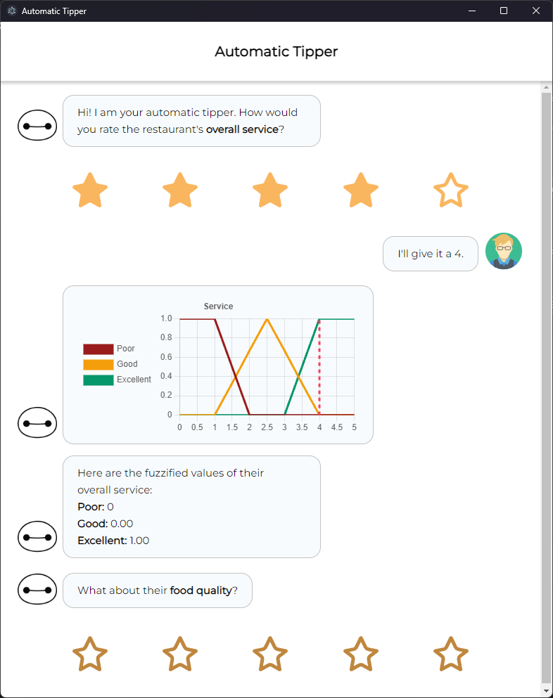

# Automatic Tipper

## How To Run

1. Go to the project directory

    ```bash
    cd automatic-tipper
    ```

2. Install dependencies

    ```bash
    npm install
    ```

3. Run local server

    ```bash
    npm run dev
    ```

## Screenshots


